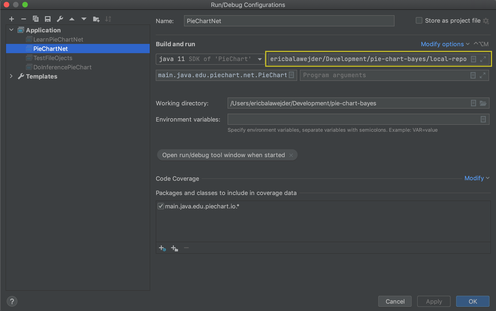

### PieChartBayes

This project uses the Mac OSX version of [Netica](https://www.norsys.com/netica-j.html#download)
and is built with the [Netica Java API](https://www.norsys.com/netica-j/docs/javadocs/index.html).

The local maven repo was generated with the following command:

```
$ mvn org.apache.maven.plugins:maven-install-plugin:2.3.1:install-file -Dfile=path/to/netica/NeticaJ.jar -DgroupId=com.norsys -DartifactId=netica -Dversion=5.0.4 -Dpackaging=jar -DlocalRepositoryPath=./local-repo
```
It holds the Netica dependencies libnetica.a and libNeticaJ.jnilib that maven can not find. 

### To run:
To build the snapshot jar:
```
$ mvn clean install
```

The Netica dependency must be linked. To run a particular class:
```
$ java -Djava.library.path=local-repo/ -classpath target/PieChart-0.0.1-SNAPSHOT.jar:local-repo/com/norsys/netica/5.0.4/netica-5.0.4.jar main.java.edu.piechart.<class-name>
```

### To run the tests:
```
$ mvn test
```

### IntelliJ and Eclipse:
When running a class that uses Netica objects in the IDE, you must set the Eclipse/IntelliJ vm arguments under run configurations to use the Netica library.
These files are in the `local-repo` and you must set the `<absolute-path-to>` to your absolute path.
```
-Djava.library.path=/<absolute-path-to>/pie-chart-bayes/local-repo
```



### Tips for development:
You can add the Netica .dne files to the .gitignore. The time stamp is updated in the file every time the .java file is run.
From the project path repository:

Place in file:
```shell
piechart_bayes_data/NetFiles/*
```
Then run:
```shell
$ git rm -r --cached piechart_bayes_data/NetFiles/
```
